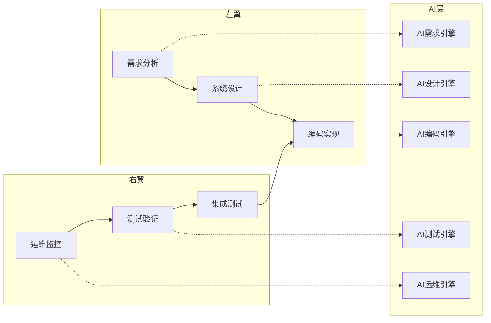
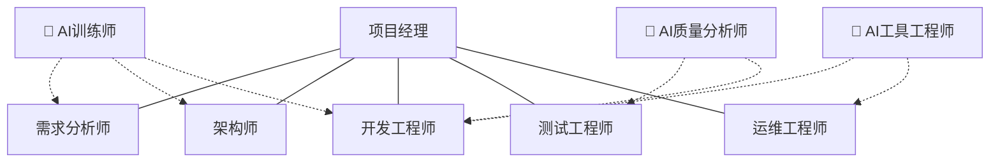
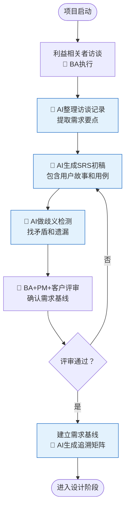
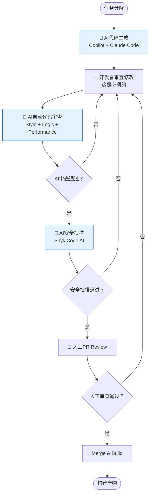
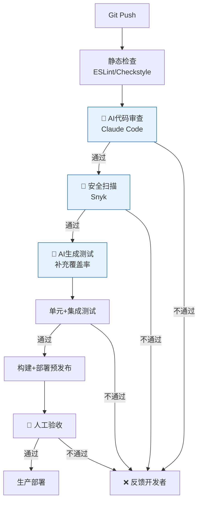

# 改进后的软件过程定义文档（AI增强版）

> 文档版本：v2.0-AI-Augmented
> 基于：v1.0 传统V模型软件过程定义
> 适用团队：5-15人中小型Web开发团队
> 编制日期：2026年6月12日—7月9日

---

## 第一章 这个文档是干什么的

### 1.1 背景

在之前的作业里，我们定义了一套基于V模型的软件过程——从需求分析、系统设计、编码实现、测试验证到运维监控，每个阶段做什么、谁来做、产出什么，都做了规定。那是一套中规中矩的传统过程定义，没啥问题，能用。

但这个学期我一直在用AI工具辅助开发，逐渐发现一个问题：原有的过程定义根本没有考虑AI这个因素。按照老定义，需求文档应该由需求分析师"编写"——但如果需求分析师用AI生成了初稿然后自己修改呢？这个过程还算"编写"吗？代码审查应该由开发者"检查"——但如果检查是AI做的、人只是确认呢？

说白了，现有的过程定义和实际的开发方式已经脱节了。这份文档就是要把AI正式纳入过程定义，说清楚AI在哪个环节、做什么事情、人负什么责任。

### 1.2 改了什么

核心改动就三件事：

1. **加了AI活动节点**：每个阶段里，那些适合AI做的事情单独列出来，标明是AI在做还是人在做
2. **加了AI角色**：训练师、质量分析师、工具集成工程师——这三个角色之前是不存在的
3. **加了AI质量标准**：AI做出来的东西不能直接算数，得有个验收标准

没有大改V模型本身的结构——V模型管得好好的，没必要为了用AI而改过程框架。AI是工具，工具是为人服务的，不是反过来。

### 1.3 适用范围

这套过程定义面向的是5-15人的中小型Web开发团队。大团队可能需要更复杂的过程治理和更多的角色细分，一两个人的小项目则可以大幅裁剪。具体怎么裁剪第七章有讲。

### 1.4 过程全景

简单来说就是在原来的V模型外面包了一层AI能力层。每个阶段都有对应的AI引擎做辅助，但流程的主干还是V模型。这样的好处是——如果哪天AI工具挂了或者某些环节不适合用AI，随时可以退回到纯人工模式。

---

## 第二章 谁做什么——角色定义

### 2.1 角色关系图

虚线表示AI角色对传统角色的支持关系。可以看到AI角色不替代任何人，而是给现有角色提供支持。

### 2.2 传统角色的职责更新

**需求分析师（BA）**

以前主要是"撰写"需求文档，现在更多是"审核"和"确认"。AI生成初稿，BA来改、来确认、来负责。工具方面习惯用Notion AI做访谈整理、用Claude生成SRS初稿。

一个实际的变化：以前写一份需求规格说明书可能要三天，其中两天花在文字编写和格式调整上。现在让AI把文字工作干了，BA多出来的时间可以去做更深入的业务分析。但最终签字的还是BA——这点不能含糊。

**架构师（SA）**

AI能给架构师帮的最大忙是生成备选方案和画图。让Claude Code根据需求列出几种可行的架构方案，分析各自的适用场景和trade-off，然后架构师来做最终选择。UML图也是——Claude加上Mermaid能把类图时序图这些生成出来，虽然细节经常要改。架构师的核心价值——做权衡决策——目前AI替代不了。

我试过让AI独立设计一个微服务拆分方案，结论是：它能给出一个逻辑上自洽但完全不考虑团队实际能力、运维成本和历史包袱的方案。架构设计不只是技术问题，更是组织和管理问题。

**开发工程师（DEV）**

这是变化最大的角色。简而言之：以前是"写代码的人"，以后可能是"审代码的人"。每天的GitHub Copilot和Claude Code就是标配，和IDE一样离不了。

具体使用上有些细节值得说一下。AI生成代码的时候，最好把需求说清楚——不是一句"写个CRUD"就完事，要说清楚技术栈、分层规范、命名规则、异常处理策略。提示词写得越具体，出来的代码越能用。还有就是，AI生成的代码一定要看，不看就合并是给自己埋雷。我在验证实验里就发现过AI写出来的代码少了一层DTO转换——不是不能用，但不符合规范。

另外GitHub Copilot X有个比较实用的功能是，它会根据你项目里已有的代码风格来调整建议。这意味着如果一个项目从一开始就规范，Copilot的建议也会更规范，形成良性循环。反之亦然。

**测试工程师（QA）**

写测试用例这个活，AI能分担掉一大半。尤其是单元测试——AI根据方法签名和逻辑就能自动生成用例，覆盖率补得比人工还全。QA的角色更多转向了：审查AI生成的用例是否合理、补充真实场景下的测试、做探索性测试。

探索性测试目前还是AI的盲区。因为AI不知道"真实用户会怎么乱点"，它只会按照逻辑推理来生成用例。QA在这块的价值短时间内不会被削弱。

**运维工程师（OPS）**

监控告警是AI的主场。Datadog AI之类的工具能自动识别异常模式，比人工设置固定阈值灵活得多。告警聚合也很有用——原来可能一次故障触发两百条告警，运维的人看得眼花，现在AI自动聚合成"某个服务的数据库连接池耗尽了"这一条核心信息。

不过生产环境的操作还是得人来。AI可以建议"建议回滚到上一个版本"或者"建议扩容两台实例"，但操作的人得是自己判断过的。这点没有商量的余地。

**项目经理（PM）**

PM的变化主要是决策信息源的变化。以前靠周报和站会了解项目状态，以后可以靠AI自动生成的度量报告。AI会告诉PM：这个Sprint的代码质量趋势在下降、测试覆盖率有下滑风险、某个模块的缺陷密度超过了阈值。信息更及时也更客观了。

当然PM不会被AI替代——管理说到底是管人，不是管数据。

### 2.3 新增的AI角色

**AI训练师**

这个角色很重要，虽然看起来不是很"硬核"。训练师的主要工作就是研究怎么让AI输出更好的结果——针对不同项目场景写提示词模板、整理项目的代码规范和业务术语丢给AI做上下文、收集团队在使用AI过程中的反馈来不断调整策略。

比方说，如果团队成员普遍反映"AI生成的SQL太啰嗦"，训练师就去优化提示词，加上"尽量使用简洁的SQL，避免不必要的子查询"之类的约束。这些积累下来的提示词模板和技术文档，就成了团队的AI知识库。

在小团队里，训练师不需要全职。找一个对技术有兴趣、平时就喜欢琢磨工具的资深开发兼任就行。

**AI质量分析师**

简单说就是负责"检查AI干活的质量"。AI不是一直靠谱的——有时候特别聪明，有时候又莫名其妙。质量分析师要定期抽查AI生成的代码、测试用例、审查报告的质量，统计AI工具的准确率和误报率。

举个例子：如果发现某个AI审查规则连续三周误报率超过30%，质量分析师就应该建议关掉这个规则或者调整参数。如果发现AI生成的测试用例在某个模块的漏测率特别高，就说明这个模块可能需要人工重点补充测试。

在小团队里，QA Lead兼任比较合适。工作量不大，一周可能就两三个小时。

**AI工具集成工程师**

偏运维方向的角色，主要负责把AI工具嵌入到开发流程里。包括：CI/CD流水线里加AI审查节点、管理各个AI工具的API Key和配额、处理工具版本升级和故障、管控代码上传到外部AI服务的安全策略。

这个人不需要写AI算法，但得懂DevOps、懂CI/CD、懂安全。在小团队里让运维或者DevOps工程师兼任就行。

---

## 第三章 每个阶段怎么做

### 3.1 需求分析阶段

几个关键点说明一下：

访谈还是人来做，AI辅助的是整理和文档化。这个分工我觉得是合理的——访谈需要共情和理解力，AI目前做不到位。但整理访谈记录这种"体力活"AI做得又快又好。

AI做歧义检测这个环节我觉得特别有价值。人工审需求文档的时候，因为审的人自己可能也是写的人，很多矛盾点看不出来。AI站在第三方的角度，反而容易发现"你前面说A后面说B"这类问题。

### 3.2 系统设计阶段

流程上跟需求阶段类似，也是"AI生成初稿→人评审修改→建立基线"的路子。

但设计阶段有个特殊的地方：**架构决策是没法让AI做的。** AI可以列出方案A、B、C，分析各自优缺点，数据分析方面做得可能比人还好。但"我们选哪个"，这个决策涉及的因素太多了——团队技术栈熟悉度、运维能力、预算限制、历史遗留、甚至政治因素——这些AI都不知道，也不该知道。

所以这个阶段的AI定位就是"信息提供者"而不是"决策建议者"。AI帮你整理信息、画出模型、列出选项，但最终的架构方向是人定的。

### 3.3 编码实现阶段

编码阶段的流程是我思考最多的，因为它最复杂也最重要。

注意这个流程的审核顺序：**AI审查 → AI安全扫描 → 人工审查。** 这是有意设计的。

AI放在第一道关，因为它不会累、不会因为跟你是好朋友就放水。它能保证基础质量——缩进、命名、空指针、资源泄露这些——不需要人来操心。

安全扫描放第二道，因为安全问题应该尽早发现。

人工审查放最后，这时候代码已经经过了AI和安全两道检查，人工可以专注于更高层次的问题：这个设计合理吗？这个业务逻辑对吗？这段代码六个月后还好维护吗？

另外有个代码质量门禁的概念。不是所有AI告警都必须修，但Severity在Medium以上的安全问题和明显违反编码规范的问题是硬性要求，不修不能合并。这个规则必须一开始就说清楚，不然团队会有争议。

### 3.4 测试验证阶段

测试阶段AI帮最多的是两件事：用例生成和自动化执行。

用Testin XAgent或者Claude根据代码自动生成测试用例，覆盖正常路径、异常路径和边界条件。然后人审查这些用例——哪些可以保留、哪些需要修改、哪些场景漏了。补完之后跑自动化测试，跑不过就修bug，跑过了再加上探索性测试。

测试阶段的AI辅助有个很有意思的特点：**AI不会偷懒。** 人写测试的时候，知道某个分支覆盖率不好补，可能会战略性放弃。AI不会，它会老老实实把所有分支都给你覆盖了。结果就是：用AI辅助写的测试，覆盖率通常会显著高于纯人工。

但反过来，AI也不懂什么叫"这个场景现实中不太可能发生，不用测"。它会生成一堆极端冷门的边界条件测试，有些确实没必要。所以人工审查测试用例的时候，该删的还是要删。

### 3.5 运维监控阶段

运维阶段分成监控和响应两个环节。

监控环节AI主导——Datadog AI或Dynatrace一直在看数据，发现异常模式就告警。PagerDuty AIOps把告警聚合成有意义的事件，避免运维被几百条告警淹没。

响应环节人主导——运维工程师接到聚合后的告警，判断严重程度。如果AI附带了根因分析和修复建议（"看起来是数据库连接池配置太小，建议从50调到200"），可以作为参考但不能直接执行。涉及生产变更的操作，必须要人确认。

故障处理完成之后，AI根据日志和时间线自动生成故障报告。这个报告省了运维工程师写文档的时间，但内容需要人工审核修改。

---

## 第四章 产出物和质量标准

### 4.1 每个阶段产出什么

| 阶段 | 产出物 | 谁负责 | AI做了什么 | 谁最终签字 |
|------|--------|--------|-----------|----------|
| 需求 | 用户故事地图 | BA | 生成初稿 | BA + PM |
| 需求 | SRS文档 | BA | 生成初稿+歧义检测 | BA + PM + 客户 |
| 需求 | 需求追溯矩阵 | BA | 自动生成 | BA |
| 设计 | 架构设计文档 | SA | 方案生成+分析 | SA |
| 设计 | UML模型 | SA | 自动绘制 | SA |
| 设计 | API接口文档 | DEV | 自动生成 | SA + DEV |
| 设计 | 数据库ER图 | SA | 自动绘制 | SA |
| 编码 | 源代码 | DEV | 生成+审查+安全扫描 | DEV（人工审查后） |
| 编码 | AI代码审查报告 | DEV | 自动生成 | DEV确认 |
| 编码 | 安全扫描报告 | DEV | 自动生成 | DEV + 安全负责人 |
| 测试 | 测试计划 | QA | 生成初稿 | QA + PM |
| 测试 | 测试用例 | QA | 生成初稿 | QA |
| 测试 | 测试报告 | QA | 自动执行+生成 | QA |
| 测试 | 缺陷报告 | QA | 辅助分类 | QA |
| 运维 | 故障处理记录 | OPS | 辅助生成 | OPS |
| 运维 | AI质量审计月报 | AIQA | 辅助生成 | AIQA + PM |

### 4.2 AI做出来的东西怎么验收

不是所有AI产出物都要用同一标准验收。我分了四个等级：

**L1参考级**：仅供参考，不直接使用。比如AI推荐的架构方案、技术选型建议。不需要正式验收。

**L2辅助级**：AI生成初稿，人审查修改。比如需求文档、设计文档的初稿。审查通过率要超过60%（就是说至少有六成内容不用大改）。

**L3可信级**：AI输出直接可用，人只需要抽查确认。比如测试用例、代码审查结果。准确率要超过90%。

**L4自主级**：AI自动执行，人只处理异常。比如代码风格检查、告警聚合。准确率要超过99%。

这个分级制度的好处是让团队对不同AI产出物有明确的预期。不用所有东西都严格审查，但也不能所有东西都闭眼信任。

---

## 第五章 怎么度量效果

### 5.1 传统指标保留

原来过程的那些度量指标继续用：进度偏差率、缺陷密度、测试覆盖率、系统可用率。这些是基础，不管用不用AI都得看。

### 5.2 新增的AI专属指标

既然加了AI，就要有办法衡量AI到底带来多大价值。我加了这几个：

- **AI代码采纳率**：AI生成的代码里，有多少被最终采纳了。这个指标反映AI生成的代码质量。如果采纳率低于70%，说明AI不太适应这个项目的代码风格，需要训练师去调优。

- **AI审查误报率**：AI审查报出来的问题里，有多少是假的。误报率太高（比如超过15%）会让开发者对AI审查失去信任，看到告警都习惯性忽略。

- **AI审查漏报率**：AI没发现、后来在测试或生产环境发现的真正缺陷。这个指标反映AI审查是不是真的靠谱。

- **AI过程覆盖率**：整个过程中，有AI参与的活动占比。用来衡量AI在组织里的渗透程度。

- **AI人均成本**：每人每月花在AI工具上的费用。控制成本用的，尤其在团队规模增长的时候。

### 5.3 数据从哪来

这些指标的数据采集其实不复杂。CI/CD流水线和AI工具API本身就输出大量数据，搭一个简单的数据管道就能收集。GitHub、SonarQube、Snyk的API都有现成的接口。

数据收集之后丢给AI自己来分析——这算是一种"元AI应用"了。AI自动生成月度质量报告，AI质量分析师审核后发给PM。

---

## 第六章 工具链

### 6.1 推荐的工具组合

这个组合是我自己用过或者认真评估过的，不一定是最优解，但至少不会翻车：

| 阶段 | 主力工具 | 用途 |
|------|---------|------|
| 需求 | Notion AI + Claude API | 需求采集整理、文档生成 |
| 设计 | Claude Code + Mermaid | 架构分析、UML绘制 |
| 编码 | GitHub Copilot X + Claude Code | 代码生成 |
| 审查 | Claude Code + Snyk Code AI | 代码审查、安全扫描 |
| 测试 | Claude API + Testin XAgent | 用例生成、自动化测试 |
| 运维 | Datadog AI + PagerDuty | 异常检测、告警管理 |

### 6.2 CI/CD里的AI节点

整个流水线里加了三个AI节点。这些节点不会显著拖慢CI/CD的速度——AI代码审查大概十几秒到一分钟，取决于变更范围。

---

## 第七章 过程治理

### 7.1 定期检查什么

| 检查什么 | 多久查一次 | 谁来查 |
|---------|----------|--------|
| AI工具使用是否合规、数据是否脱敏 | 每月 | AI质量分析师 |
| AI产出物质量抽查 | 每月 | AI质量分析师 |
| 代码审查（AI+人工）是否完整执行 | 每Sprint | 架构师 |
| AI工具成本有没有超预算 | 每月 | PM |
| 整体改进效果、指标有没有达标 | 每季度 | PM + AIQA |

### 7.2 不同规模项目怎么裁剪

不是所有项目都要全套AI过程。根据实际情况裁剪：

- **1-3人的小项目**：只保留AI代码生成和审查（性价比最高），AI角色全部由开发兼任，不需要设岗
- **5-15人的中型项目**：采用完整AI增强过程，设兼职AI训练师（其他AI角色可兼任）
- **15人以上**：完整过程+专职AI角色，质量门禁更严格
- **遗留系统维护**：重点用AI做代码审查和测试生成，别在需求分析和设计上浪费AI资源

---

## 附录

### A. 术语解释

| 缩写 | 全称 | 意思 |
|------|------|------|
| AAVM | AI-Augmented V-Model | 本文档定义的AI增强版V模型 |
| RAG | Retrieval-Augmented Generation | 结合知识库检索的AI生成技术 |
| KLOC | Kilo Lines of Code | 千行代码，度量代码规模用的 |
| AIT | AI Trainer | AI训练师 |
| AIQA | AI Quality Analyst | AI质量分析师 |
| AITE | AI Tooling Engineer | AI工具集成工程师 |

### B. 参考依据

1. ISO/IEC 12207:2017 软件生命周期过程标准
2. IEEE 730-2014 软件质量保证过程标准
3. 中国信通院《智能化软件测试技术与应用要求》2024
4. Gtest《全流程自动化测试技术白皮书》2025

### C. 修订记录

| 版本 | 日期 | 改了什么 |
|------|------|---------|
| v1.0 | 2026.06.10 | 初始版本，传统V模型过程定义 |
| v2.0 | 2026.07.09 | AI增强改版——新增AI角色、活动节点、度量指标 |
