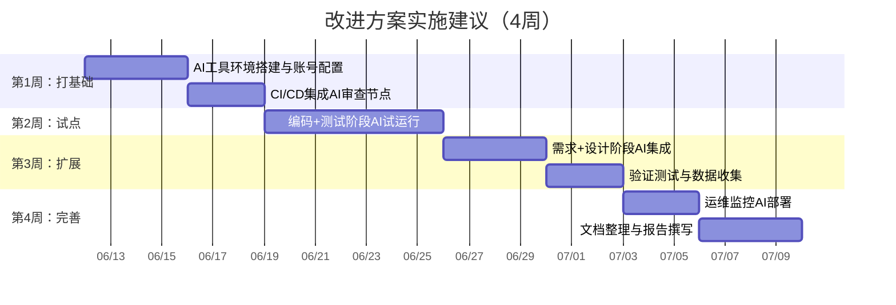

# 软件过程改进方案设计文档

> 软件过程与管理 · 作业第二部分
> 2026年6月12日—7月9日

## 一、为什么要改

上个作业我们定义了一套基于V模型的软件过程，涵盖了需求、设计、编码、测试、运维五个阶段。那个过程定义本身没什么问题，结构清晰、可追溯——但它有一个默认前提：所有工作都是人做的。

实际情况是，现在写代码很少是纯人工了。我自己这半年的体验是，有了Copilot和Claude Code之后，写代码的方式已经变了——以前是"想好逻辑、敲代码、调试"，现在是"描述需求、AI生成、审查修改"。效率提升很明显，但问题是：这个过程变化完全是自发的、个人的，没有一个系统的规范和标准。

比如说，AI生成的代码要不要审查？如果要，审查标准是什么？AI生成的测试用例算不算数？AI发现的安全漏洞谁负责修？这些问题不解决，AI用得越多反而越乱。

所以这个改进方案的核心思路就是：**把AI正式纳入软件过程，给它一个明确的角色定位，同时也划清楚边界——什么让AI做，什么必须人来做。**

## 二、改进后的过程长什么样

整体框架还是V模型，因为V模型的可追溯性和阶段性管理确实好用。我在每个阶段里加了AI执行节点，用不同的协作模式来区分AI的参与程度。

```mermaid
graph TB
    subgraph 需求分析
        A1[需求访谈调研] --> A2[🤖 AI辅助需求采集与整理]
        A2 --> A3[🤖 AI生成需求文档初稿]
        A3 --> A4[🤖 AI歧义检测]
        A4 --> A5[👤 人工评审确认]
        A5 --> A6[建立需求基线]
    end

    subgraph 系统设计
        B1[设计方向确定] --> B2[🤖 AI生成架构方案]
        B2 --> B3[🤖 AI生成UML模型]
        B3 --> B4[👤 架构师评审优化]
        B4 --> B5[建立设计基线]
    end

    subgraph 编码实现
        C1[任务分解分配] --> C2[🤖 AI代码生成]
        C2 --> C3[👤 开发者审查修改]
        C3 --> C4[🤖 AI代码审查]
        C4 --> C5[🤖 AI安全扫描]
        C5 --> C6[👤 人工PR Review]
        C6 --> C7[代码合并]
    end

    subgraph 测试验证
        D1[🤖 AI测试用例生成] --> D2[👤 用例评审补充]
        D2 --> D3[🤖 AI自动化测试执行]
        D3 --> D4[👤 缺陷确认与追踪]
        D4 --> D5[质量放行]
    end

    subgraph 运维监控
        E1[🤖 AI异常检测] --> E2[🤖 AI告警聚合]
        E2 --> E3[👤 运维处理]
        E3 --> E4[🤖 AI故障报告生成]
    end

    A6 --> B1
    B5 --> C1
    C7 --> D1
    D5 --> E1

    style A2 fill:#e3f2fd,stroke:#1565c0
    style A3 fill:#e3f2fd,stroke:#1565c0
    style A4 fill:#e3f2fd,stroke:#1565c0
    style B2 fill:#e3f2fd,stroke:#1565c0
    style B3 fill:#e3f2fd,stroke:#1565c0
    style C2 fill:#e3f2fd,stroke:#1565c0
    style C4 fill:#e3f2fd,stroke:#1565c0
    style C5 fill:#e3f2fd,stroke:#1565c0
    style D1 fill:#e3f2fd,stroke:#1565c0
    style D3 fill:#e3f2fd,stroke:#1565c0
    style E1 fill:#e3f2fd,stroke:#1565c0
    style E2 fill:#e3f2fd,stroke:#1565c0
    style E4 fill:#e3f2fd,stroke:#1565c0
```

图中蓝色节点就是AI参与的活动。可以看到AI分散在各个阶段，但所有的关键决策节点（基线建立、评审确认、放行决策）都还是人来做。

## 三、三种协作模式

我根据AI参与程度的不同，把人和AI的协作分成了三种模式。这个区分挺重要的，因为不同类型的活动需要的协作方式完全不同。

**第一种：AI辅助模式（AI-Assisted）**

这是最常用的模式。AI负责生成初稿或提供建议，人来做最终的审查和修改。典型场景是需求文档、设计文档、测试用例的编写。打个比方，AI就像个实习生——能帮你把活儿干完，但你得检查一遍才能交出去。

**第二种：AI自动模式（AI-Automated）**

AI自动执行，人只在出现异常时介入。代码风格检查、安全漏洞扫描、异常检测这些就属于这一类。这些检查以前也有自动化工具，但AI的加入让检查更"聪明"了——不只是匹配规则，而是能理解代码的语义。

**第三种：人工主导模式（Human-Led）**

关键决策还是人来做，AI可以提供数据分析和建议，但不参与决策本身。比如架构方案的最终选择、需求优先级的排序、生产环境的操作决策等。这个模式的存在是为了保证"AI可以帮忙但不能背锅"——当出了问题的时候，责任人必须是明确的。

## 四、要不要设AI岗位？

这个问题我想了挺久。对于5-15人的中小团队来说，专门设几个AI岗位显然不现实，成本摆在那里。但如果完全不设岗，AI相关的工作就会变成"谁有空谁做"，最后就没人做了。

所以我的方案是：**设三个AI相关角色，但在小团队里可以由现有人员兼任。**

**AI训练师**——这个人主要负责调教AI。不同的项目有不同的代码规范、业务术语、架构风格，通用的AI模型如果不加调教，输出质量会差很多。训练师的工作就是做Prompt Engineering、维护项目的知识库、收集大家对AI输出的反馈来持续优化。在小团队里，这个角色可以找一个对技术比较热情的资深开发来兼任。

**AI质量分析师**——负责盯着AI干活的水平。定期抽查AI生成的代码和文档质量，统计AI代码审查的误报率和漏报率。说白了就是"监督AI的监督者"。这个角色在刚开始引入AI的时候特别重要，因为AI的表现波动比较大，需要有人盯。稳定运行一段时间后可以降低频率。小团队让QA Lead兼任就行。

**AI工具集成工程师**——负责把AI工具嵌入CI/CD流水线，管理API配额和权限，处理工具的版本升级和故障。这个角色偏DevOps方向，小团队让运维或DevOps工程师兼任很自然。

这三个角色不一定要全职，关键是职责要明确到人，不能"大家都用AI但没人对AI负责"。

## 五、每个阶段具体怎么改

### 需求阶段

原来需求分析师要花大量时间把访谈记录整理成需求文档，这个过程又枯燥又容易出错。现在我的想法是这样：先用AI工具把访谈录音转成文字并提取要点（这一步已经比较成熟了），然后让AI根据要点生成需求文档的初稿，包括用户故事和用例描述。之后AI再做一轮自我检查，找出文档中的矛盾和模糊之处。

需求分析师拿到这个初稿和检查报告之后，主要工作就变成了"审核"而不是"从零编写"。我觉得这个转变挺关键的——从执行者变成了把关者。

工具方面，Notion AI适合用来做需求采集的结构化整理，Claude的API适合生成需求文档和做歧义检测。成本大概每月几十美金的样子。

### 设计阶段

这一块我自己试用下来的感觉是：AI能帮不少忙，但不能指望它完全替代架构师的判断。

具体来说，让Claude Code根据需求描述生成架构方案是有用的——它会把各种常见的架构模式都列出来并分析利弊，相当于是帮你做了第一轮头脑风暴。Mermaid AI可以根据需求自动生成UML图的初稿，虽然大概只有七成准确率（类之间的关系经常搞错），但用来做初稿然后人工改比从零画快太多了。

不过有个问题：AI推荐的架构方案往往偏向"最常见"的方案，缺乏针对具体项目约束的创新。所以架构师这一步不能省，AI生成的方案只能当参考。

### 编码阶段

这是最成熟、也是我最有把握说效果好的阶段。

代码生成方面，Copilot X和Claude Code的组合基本能满足日常开发80%以上的代码量需求。特别是CRUD、数据校验、API调用这种套路化的工作，AI生成得又快又好。复杂算法逻辑AI也能写，但出错概率大一些，需要仔细审查。

代码审查方面，我想强调一个细节。在改进后的流程里，AI代码审查是放在人工Review之前的——相当于是第一道防线。这样做的原因是：AI审查不会累、不会漏、不会碍于面子不说问题，它能保证最基本的质量问题（命名规范、空指针、资源泄露等）不在人工Review环节浪费时间。人工Review则可以专注于更高层面的事情：架构合理性、业务正确性、可维护性。

安全扫描我用的Snyk Code AI，它会分析依赖漏洞和常见的安全问题（SQL注入、XSS等），效果还可以，误报率在可接受范围内。

### 测试阶段

测试这块原来是我觉得最枯燥的部分——写测试用例、造测试数据、写断言。现在让AI来做这些事情效率提升很明显。

Testin XAgent能根据代码自动生成单元测试，覆盖率补得挺全的。Claude更灵活一些，可以跟它说"帮我给这个Service类的所有public方法生成测试，覆盖正常路径、异常路径和边界条件"，它出来的效果比XAgent更贴近业务理解。

但我也发现一个问题：AI生成的测试用例有时候太"规范"了，反而会漏掉一些真正的边界情况。比如一个借书功能，AI会测试"用户借了5本书不能再借"，但不会想到"用户借了4本书，归还1本后马上再借"这种并发场景。这种还是需要人根据经验来补充。

还有一个我实践下来觉得好用的点：让AI根据需求文档生成验收测试用例。这些用例可以作为跟客户确认验收标准的依据，比纯口头沟通靠谱多了。

### 运维阶段

运维这块我的实践经验比较少，主要参考了一些文章和案例。

核心思路是这样的：生产环境跑着的时候，AI一直在看监控数据，发现异常自动告警并给出初步分析，运维工程师确认后处理。出了故障之后，AI自动拉取相关日志和时间段的监控数据，生成故障报告的初稿。

我自己觉得运维是AI最有价值的场景之一，因为运维数据量大、模式重复，特别适合AI来处理。但运维也是最敏感的场景——AI误判导致错误操作的风险很高。所以在这个阶段我特别强调了"AI只能建议、人必须决策"的原则。

## 六、工具选型

实际落地的话，我推荐这套组合。都是我自己用过或者认真评估过的：

| 阶段 | 主工具 | 备选 | 大概成本 |
|------|--------|------|---------|
| 需求 | Claude API | Notion AI | 按量付费，约$20-50/月 |
| 设计 | Claude Code + Mermaid | - | Claude Code订阅$20/月 |
| 编码 | GitHub Copilot X + Claude Code | Cursor | Copilot $19/月 + Claude $20/月 |
| 审查 | Claude Code Review | SonarQube AI | 已含在订阅中 |
| 安全 | Snyk Code AI | CodeQL | 免费版够小团队用 |
| 测试 | Claude API + Testin XAgent | DiffBlue Cover | Claude API按量，XAgent按项目 |
| 运维 | Datadog AI + PagerDuty | Dynatrace | 取决于主机数量 |

对于一个5-10人的团队，全套AI工具的人均月成本大概在$50-100之间。相比于节省的人力成本，这个投入回报率是很高的。

## 七、可能踩的坑

最后说一下我担心的几个风险点：

**数据安全问题**。这个我觉得是最需要重视的。把代码上传到外部AI服务，理论上就有泄露风险。短期方案是用企业版API（GitHub和Anthropic都有承诺企业版数据不用于训练），长期可以考虑私有化部署。另外，在上传代码到AI工具之前最好做一遍敏感信息过滤，至少把数据库密码、API Key这些东西去掉。

**过度依赖问题**。我自己就有点这种感觉——用了半年Copilot之后，有些基础语法都有点生疏了。对于团队来说，如果新人从第一天就用AI写代码，基础能力的培养肯定会受影响。我觉得比较好的做法是：新人前三个月尽量不用AI辅助编码，先把基本功打好；老开发者正常使用但定期做无AI的Code Review或结对编程。

**AI输出质量的波动**。这个现象挺明显的。同一个问题，不同时间问同一个AI，回答质量可能差很多。有时侯它特别靠谱，有时候又胡言乱语。所以在关键环节（比如架构决策、安全相关代码）不能只看一次AI的输出，最好多个工具交叉验证。

**责任归属问题**。如果AI生成的代码导致了生产事故，算谁的？我的态度很明确：算开发者的。因为不管AI写了什么，最终是人点了"合并"按钮。这也是为什么我坚持"人工审查不能省"的原则。AI可以帮忙，但不替你背锅。

---

**参考资料**（完整列表见综合作业报告）：
- 中国信通院《智能化软件测试技术与应用要求（第3部分）》2024
- Gtest《全流程自动化测试技术白皮书》2025
- GitHub Copilot Workspace文档 2025
- 周明辉等《生成式AI在软件工程中的应用》计算机学报 2025
- Peng et al. "The Impact of AI on Developer Productivity" ACM TOSEM 2024
