# 《软件过程改进方案设计文档》

项目名称：校园二手教材交易平台  
改进目标：在原 Scrum + DevSecOps 过程基础上，引入 AI 技术节点，形成可执行、可审查、可度量的智能化软件过程。

## 一、改进原则

本方案不把 AI 作为独立于过程之外的“万能工具”，而是把 AI 节点嵌入现有活动，使其产生可审查的中间交付物。AI 的输出必须经过责任人确认，不能直接成为最终需求、最终设计或最终代码。过程改进遵循四个原则。

第一，AI 负责扩展候选项，人负责决策。需求、架构、测试和代码审查中的 AI 输出均为候选结果，需要由产品负责人、架构师、开发负责人或测试负责人签收。

第二，AI 输出必须可追溯。每份 AI 生成内容应保留输入材料、提示词、工具版本、输出摘要、人工修改记录和采纳理由。

第三，AI 节点必须进入度量体系。过程不只记录“用了 AI”，还要记录节省时间、缺陷发现、返工减少、人工复核通过率等指标。

第四，数据安全优先。学生身份信息、联系方式、订单记录不得直接输入公共 AI 工具，验证过程使用脱敏样例。

## 二、改进后的总体流程

```mermaid
flowchart LR
    A[原始需求输入<br/>访谈 问卷 竞品分析] --> B[AI 需求整理<br/>用户故事 规则表 验收标准]
    B --> C[产品负责人评审<br/>取舍 优先级 冲突确认]
    C --> D[AI 一致性检查<br/>冲突 歧义 边界条件]
    D --> E[Sprint 计划<br/>拆分任务和测试目标]
    E --> F[AI 辅助设计<br/>状态机 架构草图 风险提示]
    F --> G[人工设计评审<br/>架构师签收]
    G --> H[AI 辅助编码<br/>样板代码 单元测试 重构建议]
    H --> I[人工代码审查<br/>安全 并发 可维护性]
    I --> J[AI 测试生成<br/>接口用例 异常路径 回归脚本]
    J --> K[测试执行与缺陷管理]
    K --> L[发布与监控]
    L --> M[AI 日志聚类与根因初判]
    M --> C
```

## 三、新增与调整角色

| 角色 | 来源 | 职责 |
|---|---|---|
| AI 需求分析师 | 产品组新增兼职角色 | 设计需求整理提示词，生成用户故事和规则表，记录 AI 输出变更 |
| AI 训练师/提示词维护员 | 团队内指定 | 维护项目提示词模板、脱敏样例、输出评价标准 |
| AI 代码审查员 | 开发组新增职责 | 使用 AI 工具检查重复代码、潜在空指针、权限校验遗漏和异常处理 |
| AI 测试分析师 | 测试组新增职责 | 基于需求和接口文档生成测试用例，筛选可执行脚本 |
| 数据安全责任人 | DevSecOps 角色强化 | 审查可输入 AI 工具的数据范围，维护脱敏规则 |

原有产品负责人保留需求最终解释权；架构师保留设计最终决策权；测试负责人保留质量放行权；运维负责人保留生产故障处理权。AI 不替代这些责任边界。

## 四、工具链选型

| 改进环节 | 推荐工具或框架 | 核心功能 | 集成方式 | 预期效率提升 |
|---|---|---|---|---|
| 需求整理 | ChatGPT/Codex 类 LLM | 访谈纪要转用户故事、验收标准、规则表 | 在需求评审前生成候选需求文档，人工评审后入库 | 需求初稿时间减少 40%-60% |
| 需求一致性检查 | LLM + 规则检查提示词 | 发现冲突、遗漏和歧义 | 对每个 Epic 建立规则表，评审前运行检查 | 需求评审缺陷发现率提升 30% |
| 架构设计 | Mermaid + LLM 架构助手 | 生成状态机、上下文图、模块依赖图 | 架构师输入约束，AI 输出候选图，人工修订 | 设计草图准备时间减少 35% |
| 编码实现 | GitHub Copilot/Codex | 代码补全、重构建议、测试样板 | IDE 插件与 PR 审查结合 | 样板代码时间减少 30%-50% |
| 测试验证 | LLM 生成测试用例 + Playwright/pytest | 生成接口和端到端测试脚本 | 需求条目与接口文档作为输入，测试负责人筛选 | 用例覆盖率提升 25% |
| 运维监控 | 日志聚类脚本 + LLM 摘要 | 异常日志归类、根因候选分析 | 生产日志脱敏后输入分析流程 | 故障初判时间减少 30% |

## 五、AI 输出物质量标准

AI 需求文档必须满足四项标准：每条用户故事有明确角色、目标和收益；每条验收标准可测试；业务规则之间没有明显冲突；所有 AI 改写都能追溯到原始访谈或问卷材料。

AI 设计输出必须满足三项标准：图中每个模块有职责说明；关键数据流和异常路径被标注；与质量属性相关的取舍被记录。未经架构师签收的 AI 图只能作为讨论草稿。

AI 代码输出必须满足五项标准：通过编译；单元测试覆盖新增逻辑；不引入明文密钥；不绕过权限校验；关键交易逻辑经过人工逐行复核。

AI 测试输出必须满足四项标准：映射到需求编号；包含正常、异常、边界和安全场景；可由测试人员复现；失败结果能对应到缺陷或需求澄清项。

## 六、风险评估与应对策略

| 风险 | 影响 | 应对策略 |
|---|---|---|
| 数据泄露 | 学生个人信息、订单信息外泄 | 使用脱敏样例；公共 AI 工具禁止输入真实手机号、学号、订单号 |
| AI 幻觉 | 生成不存在的业务规则或接口 | 输出必须关联来源；无来源内容标记为“候选假设” |
| 模型偏见 | 对用户行为或纠纷责任判断不公平 | 纠纷处理建议只做辅助，不允许 AI 自动判责 |
| 技术依赖 | 团队过度依赖 AI，人工能力下降 | 保留人工评审清单；关键设计要求人工说明理由 |
| 代码安全缺陷 | AI 生成代码漏掉权限或并发控制 | PR 设置安全审查门禁；交易逻辑必须人工复核 |
| 成本不可控 | 大量提示词调用造成费用增加 | 只在关键节点调用；建立提示词模板与复用机制 |

## 七、过程度量指标

| 指标 | 定义 | 目标 |
|---|---|---|
| AI 需求采纳率 | 被人工评审采纳的 AI 需求条目数 / AI 生成需求条目数 | 60%-80% |
| AI 输出返工率 | 需大幅重写的 AI 输出数 / AI 输出总数 | 小于 25% |
| 需求评审缺陷前移率 | 评审阶段发现的缺陷数 / 总需求缺陷数 | 提升到 50% 以上 |
| 测试覆盖提升率 | AI 补充后新增有效测试数 / 原测试数 | 大于 25% |
| PR 审查辅助命中率 | AI 提示被确认的问题数 / AI 提示总数 | 大于 40% |
| 故障初判时间 | 从告警出现到形成候选原因的时间 | 减少 30% |

## 八、落地计划

第 1 周完成提示词模板、脱敏规则和需求场景试点；第 2 周将 AI 需求整理和一致性检查纳入 Sprint 计划会；第 3 周在订单模块试用 AI 测试生成和 AI 代码审查；第 4 周汇总效率与质量数据，修订过程文档并形成正式团队规范。

本方案的可落地性在于它不要求团队一次性替换工具链，也不要求 AI 自动控制生产环境。所有 AI 活动都被放置在现有评审、编码、测试和运维节点之前或之中，产出为可检查的中间材料。因此，它既能体现智能化软件工程趋势，也能保持软件过程管理所需的责任边界与审计能力。

