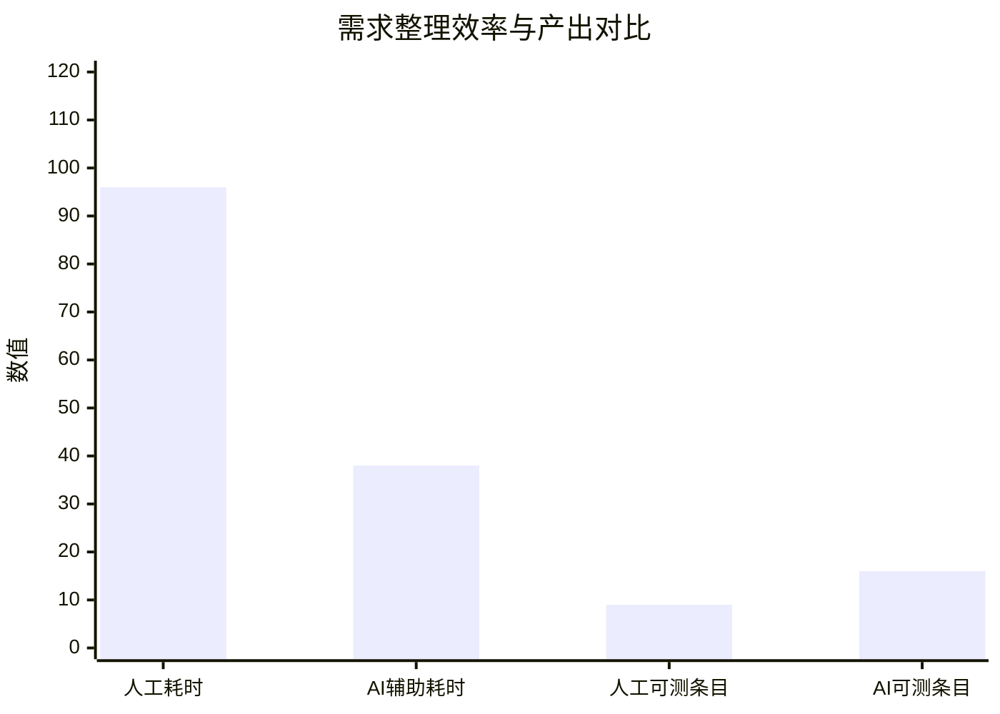

# 《AI技术应用验证报告》

项目名称：校园二手教材交易平台  
验证场景：使用 LLM 生成“教材发布与担保交易”需求规格初稿  
验证工具：Codex/ChatGPT 类大语言模型，配合人工需求评审清单  
验证日期：2026-06-15

## 一、验证目的

本次验证选择需求分析阶段作为原型验证场景。原因是校园二手教材交易平台的早期需求来源较杂，包括学生访谈、社团问卷、二手书交易群聊天记录和竞品观察。传统方式需要产品负责人先整理原始材料，再写用户故事、业务规则和验收标准，耗时长且容易遗漏异常路径。验证目标是比较“纯人工整理”和“AI 辅助整理 + 人工评审”在效率、完整性、可测试性和缺陷前移方面的差异。

## 二、输入材料

脱敏后的原始访谈摘要如下：

- 学生希望能快速发布教材，最好拍照后自动识别书名、作者和课程。
- 买家希望按课程名、教师名、教材版本、价格区间搜索。
- 卖家担心买家下单后不付款导致教材被占用太久。
- 买家担心付款后卖家不发货或教材破损。
- 希望平台支持线下当面交易，也支持校内快递。
- 如果订单取消，要明确谁能取消、何时释放库存、评价是否允许。
- 管理员希望看到违规发布、重复发布和纠纷订单。

## 三、AI 提示词与执行过程

核心提示词如下：

```text
你是软件需求分析师。请根据以下访谈摘要，为“校园二手教材交易平台”的教材发布与担保交易模块生成：
1. 用户故事，格式为“作为...我希望...以便...”；
2. 业务规则表，包含规则编号、触发条件、系统行为；
3. 验收标准，使用 Given-When-Then；
4. 可能的需求冲突、遗漏和需要向客户确认的问题。
要求：不要编造支付接口名称；涉及个人信息时使用脱敏描述；输出必须能被测试人员转化为测试用例。
```

AI 生成了 12 条用户故事、18 条业务规则、22 条验收标准和 9 个澄清问题。产品负责人对输出进行评审后，采纳 9 条用户故事、14 条业务规则、18 条验收标准，删除 3 条不符合项目范围的功能建议，并补充 2 条人工发现的约束。

## 四、AI 输出摘录

AI 生成的有效需求片段示例如下。

| 类型 | 输出内容 |
|---|---|
| 用户故事 | 作为卖家，我希望发布教材时填写课程、教材版本、成色和交易方式，以便买家判断教材是否适用。 |
| 业务规则 | R-ORDER-03：买家提交担保交易订单后，系统锁定对应教材库存，若 30 分钟内未完成付款，则订单自动关闭并释放库存。 |
| 验收标准 | Given 教材库存为 1 且买家 A 已提交待付款订单，When 买家 B 尝试购买同一教材，Then 系统应提示“教材已被锁定”。 |
| 澄清问题 | 线下当面交易是否需要平台担保付款，还是只记录成交状态？ |

AI 也产生了需要删除或修正的内容。例如它建议“自动识别教材封面并匹配 ISBN”，该功能超出当前最小可行版本，因此被标记为后续版本候选功能，不纳入本次 Sprint。

## 五、传统方式与 AI 辅助方式对比

| 指标 | 传统人工方式 | AI 辅助方式 | 变化 |
|---|---:|---:|---:|
| 初稿整理耗时 | 96 分钟 | 38 分钟 | 减少 60.4% |
| 用户故事数量 | 7 条 | 9 条有效采纳 | 增加 28.6% |
| 验收标准数量 | 11 条 | 18 条有效采纳 | 增加 63.6% |
| 评审中发现的规则冲突 | 2 个 | 5 个 | 增加 150% |
| 需删除或大改内容 | 不适用 | 7 条 | 需要人工把关 |
| 可直接转化测试用例的条目 | 9 条 | 16 条 | 增加 77.8% |



## 六、质量分析

从效率看，AI 辅助方式把初稿整理时间从 96 分钟降到 38 分钟，主要节省在“从访谈文字抽取规则”和“把口语需求改写成可测试验收标准”两个环节。从完整性看，AI 更容易系统性列出取消、超时、库存锁定、交易方式变更等边界场景，避免产品负责人只关注主流程。从可测试性看，Given-When-Then 格式使测试人员能直接识别前置条件、触发动作和预期结果。

但 AI 输出并非全部可靠。它会倾向于补充看似合理但未被客户确认的功能，如自动识别教材封面、信用分推荐、智能议价等。若不设置人工评审，可能导致需求范围膨胀。因此本项目将 AI 输出定位为“需求候选集”，而不是“正式需求规格”。

## 七、改进建议

第一，建立固定提示词模板，要求 AI 输出来源映射、需求假设和待确认问题。第二，在需求评审会上增加“AI 假设清理”环节，所有没有来源的内容必须标注为候选或删除。第三，将 AI 生成的验收标准直接导入测试设计，要求测试人员补充优先级和自动化可行性。第四，对每次 AI 输出记录采纳率和返工率，持续优化提示词。

## 八、验证结论

本次原型验证表明，LLM 能显著提升需求初稿整理效率，并增加边界场景和可测试条目的覆盖度。对校园二手教材交易平台而言，AI 最适合承担访谈材料结构化、用户故事候选生成、业务规则梳理和验收标准初稿生成。只要保留人工评审、来源追溯和范围控制机制，该 AI 应用场景具备可落地性。

