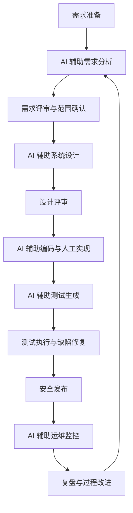

# 《改进后的完整软件过程定义文档》

项目名称：校园二手教材交易平台  
过程名称：AI 增强 Scrum + DevSecOps 软件过程  
适用范围：适用于 5 到 9 人小型 Web 应用团队，覆盖需求、设计、编码、测试、发布、运维和持续改进全过程。

## 一、过程概述与目标

校园二手教材交易平台服务于高校学生教材流转场景，目标是在学期初和学期末高峰期提供稳定、可信、易用的二手教材交易服务。平台需要处理教材发布、教材搜索、担保交易、库存锁定、订单取消、线下交付、校内配送、评价与纠纷处理等业务。由于用户群体集中、交易时间窗口明显、订单规则多且异常路径多，项目对需求清晰度、交易一致性、测试覆盖率和运维响应速度都有较高要求。

改进后的软件过程以 Scrum 为迭代骨架，以 DevSecOps 为交付与运维闭环，以 AI 技术作为需求整理、设计辅助、编码审查、测试生成和日志分析的过程增强节点。过程目标包括：缩短需求初稿整理时间；提升需求评审阶段的冲突发现率；提高异常交易测试覆盖；减少重复编码与低级缺陷；缩短生产问题初判时间；建立 AI 输出的质量标准、责任边界和度量机制。

本过程强调“AI 参与但不自动放行”。所有 AI 生成结果必须经过对应责任人确认，关键业务规则、交易状态、权限校验和发布决策必须保留人工签收。AI 的作用是提供候选产物、提示风险、补充边界条件和提高文档化效率。

## 二、生命周期阶段

本过程将生命周期划分为六个阶段：需求准备、需求分析与评审、系统设计、编码实现、测试验证、发布运维与持续改进。每个阶段均定义输入、活动、角色、交付物和质量标准。

## 三、角色职责定义

产品负责人负责管理产品待办列表，确认需求优先级，决定 AI 生成需求是否采纳。Scrum Master 负责组织迭代计划会、每日站会、评审会和回顾会，并检查 AI 节点是否按流程执行。架构师负责系统边界、模块划分、订单状态机、交易一致性和关键质量属性设计。开发人员负责功能实现、单元测试和代码自查。测试负责人负责测试策略、测试用例评审、缺陷管理和质量放行。运维负责人负责部署流水线、监控告警和故障响应。数据安全责任人负责脱敏规则、AI 工具使用边界和敏感数据审查。

新增 AI 需求分析师负责将访谈纪要、问卷和竞品分析整理成候选用户故事、业务规则和验收标准。新增 AI 代码审查员负责在 PR 前使用 AI 工具检查重复逻辑、空值风险、权限遗漏和异常处理不足。新增 AI 测试分析师负责根据需求编号和接口文档生成测试用例候选集，并将有效用例映射到自动化脚本。AI 提示词维护员负责维护提示词模板、工具版本记录、输出评价表和采纳率数据。

## 四、阶段活动与交付物

### 1. 需求准备阶段

输入包括访谈纪要、问卷结果、竞品功能清单、历史缺陷、客服反馈和业务目标。活动包括原始资料脱敏、资料分类、需求来源编号和 AI 输入包准备。任何包含姓名、手机号、学号、订单号和支付信息的内容必须先脱敏。交付物包括《需求来源清单》《脱敏样例集》《AI 需求分析输入包》。

质量标准：每条原始资料有来源编号；敏感数据已替换为占位符；输入包中明确说明项目范围和不得编造外部接口。

### 2. 需求分析与评审阶段

AI 需求分析师使用固定提示词生成用户故事、业务规则、验收标准和待确认问题。产品负责人对候选需求进行筛选，删除超出范围的功能，合并重复条目，标记待确认假设。随后使用 AI 一致性检查提示词，对订单、库存、取消、付款、退款和评价规则进行冲突检查。需求评审会上，团队逐条确认需求编号、优先级、验收标准和测试可行性。

交付物包括《AI 技术应用场景匹配报告》《产品待办列表》《需求规则表》《验收标准清单》《需求评审记录》。质量标准：每条需求有来源或假设标记；每条验收标准可测试；所有 P1 需求完成冲突检查；AI 生成但未采纳的内容保留删除原因。

### 3. 系统设计阶段

架构师根据需求基线定义上下文图、模块图、订单状态机、数据模型和接口契约。AI 工具用于生成候选 Mermaid 图、状态迁移表和架构风险提示。重点设计对象包括教材发布模块、搜索推荐模块、订单担保模块、库存锁定模块、评价纠纷模块和管理后台。架构师必须审查 AI 设计输出是否符合实际技术栈、数据一致性要求和安全策略。

交付物包括《架构设计说明》《订单状态机》《接口契约》《数据字典》《设计评审记录》。质量标准：订单状态迁移完整；库存锁定与释放规则明确；取消和退款路径有异常处理；所有外部依赖有降级方案；AI 生成图经过人工修订。

### 4. 编码实现阶段

开发人员按 Sprint 任务实现功能。AI 工具可用于生成控制器样板、DTO、表单校验、单元测试、重构建议和代码解释。所有 AI 代码必须进入正常代码审查流程。交易一致性、权限判断、支付回调、退款逻辑和评价规则不得仅依赖 AI 生成，需要开发人员逐行说明实现理由。

交付物包括源代码、单元测试、PR 说明、AI 代码使用记录和代码审查记录。质量标准：新增代码通过编译；单元测试覆盖关键分支；无硬编码密钥；接口有权限校验；异常处理有日志；AI 生成代码的采纳位置可追溯。

### 5. 测试验证阶段

测试负责人根据需求编号制定测试计划。AI 测试分析师输入用户故事、业务规则和接口文档，生成测试用例候选集，覆盖正常路径、异常路径、边界条件、安全场景和回归场景。测试人员筛选后形成正式用例，并将高价值用例转为自动化脚本。对教材发布、库存锁定、担保交易、订单取消、评价纠纷等核心路径执行手工测试和自动化测试。

交付物包括《AI 技术应用验证报告》《测试计划》《测试用例清单》《自动化测试脚本》《缺陷报告》《测试总结》。质量标准：所有 P1 需求至少有 1 条正常用例和 2 条异常用例；订单模块覆盖并发和超时场景；AI 生成用例有采纳率记录；缺陷修复后完成回归测试。

### 6. 发布运维与持续改进阶段

发布前执行构建、单元测试、接口测试、安全扫描和发布审批。发布后监控接口响应时间、订单失败率、支付回调异常、搜索延迟、错误日志和用户投诉。运维负责人对脱敏日志进行 AI 聚类，形成候选根因和排查建议。故障复盘时，将 AI 判断与实际根因对照，更新监控规则、测试用例和需求规则表。

交付物包括《发布清单》《监控看板》《故障复盘记录》《过程改进项清单》。质量标准：发布前所有阻断缺陷关闭；核心接口监控完整；生产日志进入脱敏流程；故障复盘包含预防措施。

## 五、交付物清单与质量标准

| 交付物 | 责任人 | 质量标准 |
|---|---|---|
| 需求来源清单 | 产品负责人 | 来源明确、脱敏完成、可追溯 |
| 用户故事与规则表 | AI 需求分析师、产品负责人 | 有来源编号、可测试、无明显冲突 |
| 架构设计说明 | 架构师 | 模块边界清晰、异常路径完整 |
| 订单状态机 | 架构师 | 状态、触发条件、回滚路径完整 |
| 源代码与单元测试 | 开发人员 | 编译通过、覆盖核心分支 |
| AI 代码使用记录 | AI 代码审查员 | 记录工具、提示词、采纳位置 |
| 测试用例清单 | 测试负责人 | 映射需求编号、覆盖异常和边界 |
| 自动化测试脚本 | 测试人员 | 可重复执行、失败原因可定位 |
| 发布清单 | 运维负责人 | 构建、测试、安全扫描和回滚方案完整 |
| 故障复盘记录 | 运维负责人 | 根因、影响、修复和预防措施明确 |

## 六、过程度量

本过程设置传统软件工程指标和 AI 贡献度指标。传统指标包括迭代完成率、需求变更率、缺陷密度、测试通过率、平均修复时间、发布成功率和故障恢复时间。AI 贡献度指标包括 AI 需求采纳率、AI 输出返工率、AI 发现需求冲突数、AI 生成有效测试数、AI 代码审查命中数、AI 日志分析命中率和 AI 节省工时估算。

AI 需求采纳率的目标为 60%-80%。如果低于 50%，说明提示词或输入质量不足；如果高于 90%，则需要检查团队是否缺少必要的批判性评审。AI 输出返工率目标小于 25%。AI 生成有效测试数应至少占新增测试用例的 25%。故障初判时间目标是在两个迭代内降低 30%。

## 七、配置管理与审计

所有需求、设计、代码、测试和发布文档统一存入 GitHub 仓库。AI 生成的重要内容以 Markdown 附录或 PR 评论形式保存，包含工具名称、时间、输入摘要、输出摘要、人工修改记录和采纳理由。提示词模板作为过程资产版本化管理。敏感数据脱敏规则作为安全基线纳入仓库，不允许在公共 Issue、PR 或 AI 对话中暴露真实个人信息。

## 八、过程改进机制

每个 Sprint 回顾会增加 AI 使用复盘议题，讨论 AI 在本迭代中节省了哪些工作、造成了哪些返工、发现了哪些人工遗漏以及哪些输出不可信。团队每月更新一次提示词模板和质量标准。若 AI 工具出现不可接受的幻觉、泄密风险或成本失控，Scrum Master 可暂停对应节点，恢复人工流程并组织专项评审。

## 九、结论

AI 增强 Scrum + DevSecOps 过程能够在不改变团队基本组织方式的前提下，提高校园二手教材交易平台的需求质量、测试覆盖和交付效率。过程设计保留了人工责任边界，并通过质量标准、度量指标和审计记录控制 AI 风险。该过程适合作为本项目后续迭代的正式软件过程定义，也可作为类似校园交易类系统引入 AI 软件工程能力的参考模板。

